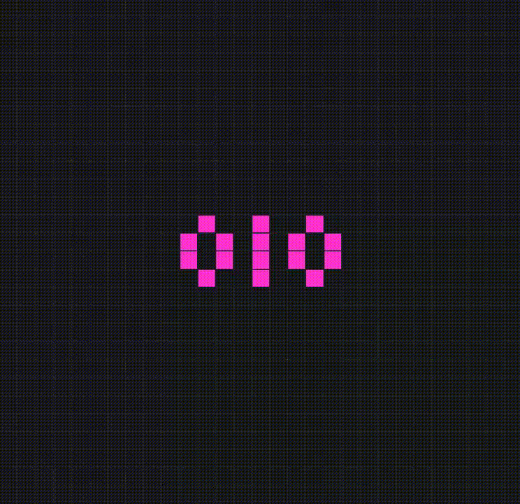

# GameOfLife
A colourful version of Conway's Game of Life.

Demo 🟪🟧🟨 https://vedantyadu.github.io/GameOfLife

## Getting started ##
- Click and drag on the grid to create a pattern.
- Click on the ***play/pause*** button or press the ***spacebar*** to start/pause.
- Adjust the ***slider*** to change the speed of the game.
- Press the ***X*** key or the ***X*** button to clear the grid.

## How it works? ##
- An inactive cell with 3 neighbours becomes active.
- An active cell with 2 or 3 neighbours remains active.
- All other cells become inactive.

## Example ##

